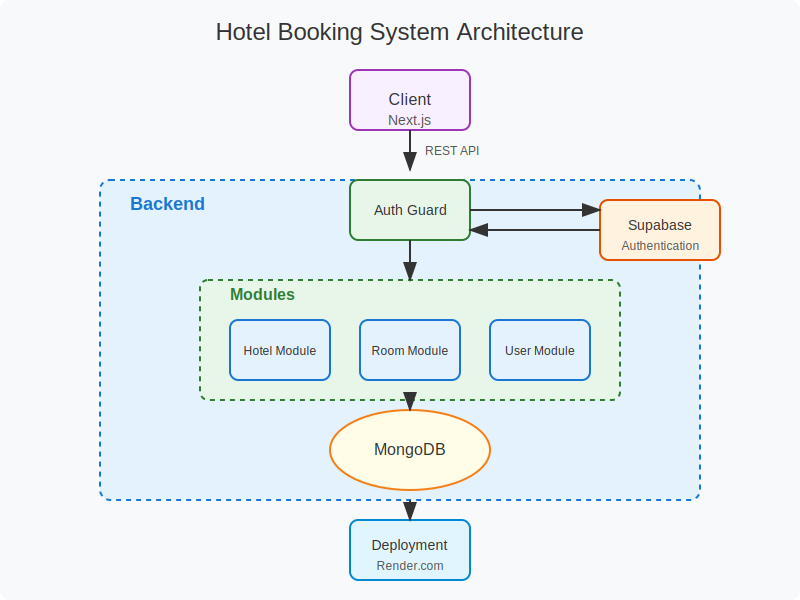

# Hotel Booking System Dashboard

## Installation

Firstly, create your own .env.production.local and .env.development.local files using the template in .env.example.local

```command
PORT=""
MONGO_URL=""
SUPABASE_URL=""
SUPABASE_KEY=""
DATABASE=""
```

Install the dependencies

```command
bun install
```

Start the project on development mode.

```command
bun start:dev
```

## Tech Stack

- Typescript
- Nest.js
- Supabase
- MongoDB

## System Architecture



## Documentation

[Swagger](https://hotel-booking-system-backend.onrender.com/docs)
